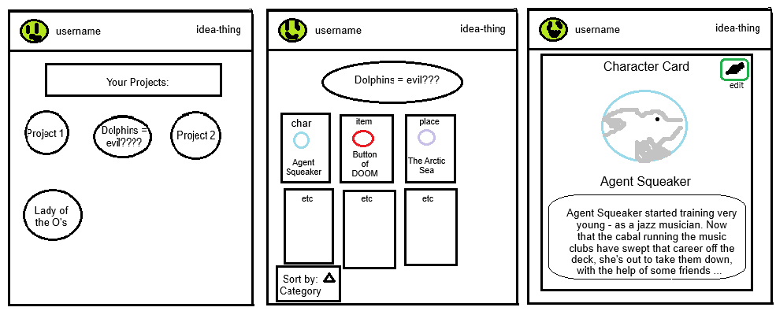

# startup: idea-thing
## Startup Application for CS260: Web Development

## HTML
Now includes a login page, a home page, a project page, a card page, and a card-edit page in HTML. The home page includes a friends section and a list of projects. I also put a menu for updating the user's profile picture, which is where the API connection to random animal pictures will be. This menu is hidden by default but you can see it in the HTML for the home page header. See [startup.idea-thing.click](https://startup.idea-thing.click/) for further details.

## Pitch
Idea-thing is a tool to help story creators organize ideas. Create character, item, or place cards, connect them with tags and add them to projects! Share your projects with your friends to build ideas together.
Soon to be hosted at [startup.idea-thing.click](https://startup.idea-thing.click/).

### Key Features
Key features of idea-thing include:
- Ability to create projects and cards.
- Ability to edit, update, and delete projects and cards.
- Ability to friend other users and share projects with them.

### Technology
Idea-thing will implement the following technologies:
- **HTML:** For correct structure for login page, homepage, project and card pages.
- **CSS:** For styling, colors, fonts, and icons within the application.
- **Javascript/React:** To allow the user to login, add projects/cards, edit current projects/cards, delete projects/cards, and more.
- **Service:** Will include endpoints for:
  - saving changes to projects/cards
  - retrieving the projects/cards belonging to a user
  - retrieving random animal pictures for the user avatars using public APIs 
- **Authentication:** The user will login to access their projects/cards, ensuring only those with permission will be able to view and edit them.
- **Database:** Authentication data for users, project and card data, friend lists, and more will be stored on the database.
- **WebSocket:** Users can make friend connections with other users and share their projects with their friends. Changes that friends make to a shared project will be visible to the user in real time.

### Preliminary Design
 From left to right: The home page, featuring a list of the user's projects; a sample project page featuring the cards within a project; a sample card page for a character card.
